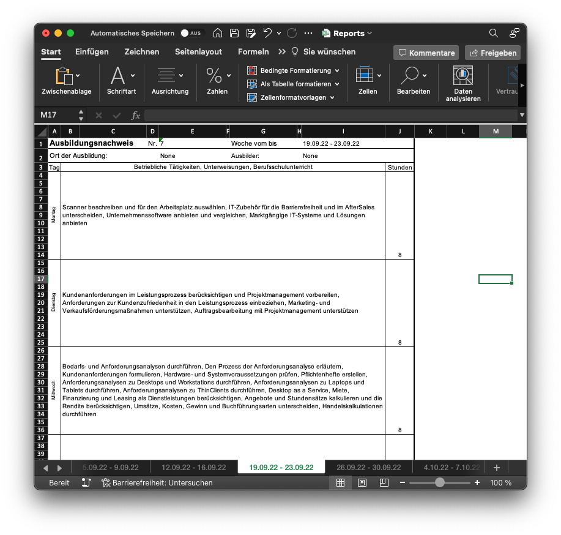

# 🎓 GFN Lernplattform Scraper Documentation 📚

## 📢 Introduction

The GFN Lernplattform Scraper is a terminal-based web scraping tool built in Rust. Its purpose is to extract course information and attendance data from the GFN Lernplattform and convert it into an XLSX format. This tool, tailored to facilitate report book creation, operates under the GNU General Public License, and its development is open on GitHub 🌐.

A key function of this tool is to sift through attendance records to pinpoint absences 🕰, providing an effective way to manage and track attendance throughout the training period.

## 🛠️ Build Requirements

Before proceeding, make sure you have the following installed:

- LLVM and clang
- Visual Studio (Windows users)

Here's how to build on Windows:

1. Install [Visual Studio](https://visualstudio.microsoft.com/downloads/).
2. Install [LLVM](https://llvm.org/builds/).
3. Set the `LIBCLANG_PATH` environment variable as `C:\Program Files\LLVM\bin`.
4. Run the build process.

## ⚙️ Core Functions

The centerpiece of the GFN Lernplattform Scraper is the `main()` function. This function undertakes a sequence of tasks, in this order:

1. **Setup Logger**: Primed for debugging and error handling 🐞. Logging takes care of both successes and failures.
2. **Create Client and Cookie Store**: Required for establishing and sustaining a session with the GFN Lernplattform 🌐.
3. **Login to Platform**: Logs into the platform using your provided credentials 🔑. Upon successful login, the next phase initiates.
4. **Scrape Course Information and Attendance**: Retrieves the data, processes it, and fabricates an XLSX file 📊.
5. **Save Cookies**: Stores the cookies for future logins 🍪.

## 🔧 Configuration

The `config.toml` file is the place to configure the scraper's operation:

### [account]

- `user_name`: Your GFN Lernplattform account username.
- `password`: Your GFN Lernplattform account password.

### [company]

- `educator_name`: The name of your personal educator.
- `location`: Your training location.

### [signature]

- `signature`: Your signature for the output XLSX file.
- `font_name`: The font of the signature in the output XLSX file.
- `font_size`: The font size of the signature.

### [website]

- `base_url`: The base URL of the GFN Lernplattform.

### [options]

- `test_mode`: Set the scraper in test mode (default is `false`).

## ❗️ Error Handling

Each operation checks for possible errors and outputs error messages 🚫. This approach ensures stability and gives clear error notifications.

## 📄 License

The tool is licensed under the GNU General Public License. Please report any issues to Marvin Juraschka (info@ccmvn.co) or on the project's GitHub page: [GitHub Page](https://github.com/ccmvn/moodle-report-portfolio)

## 🎉 Conclusion

The GFN Lernplattform Scraper offers a straightforward and efficient means to extract data from the GFN Lernplattform, streamline your report book creation process, and keep an eye on your attendance record. Its clear instructions, detailed error messages, and open-source nature make it a go-to tool for anyone undergoing training on the GFN Lernplattform.
